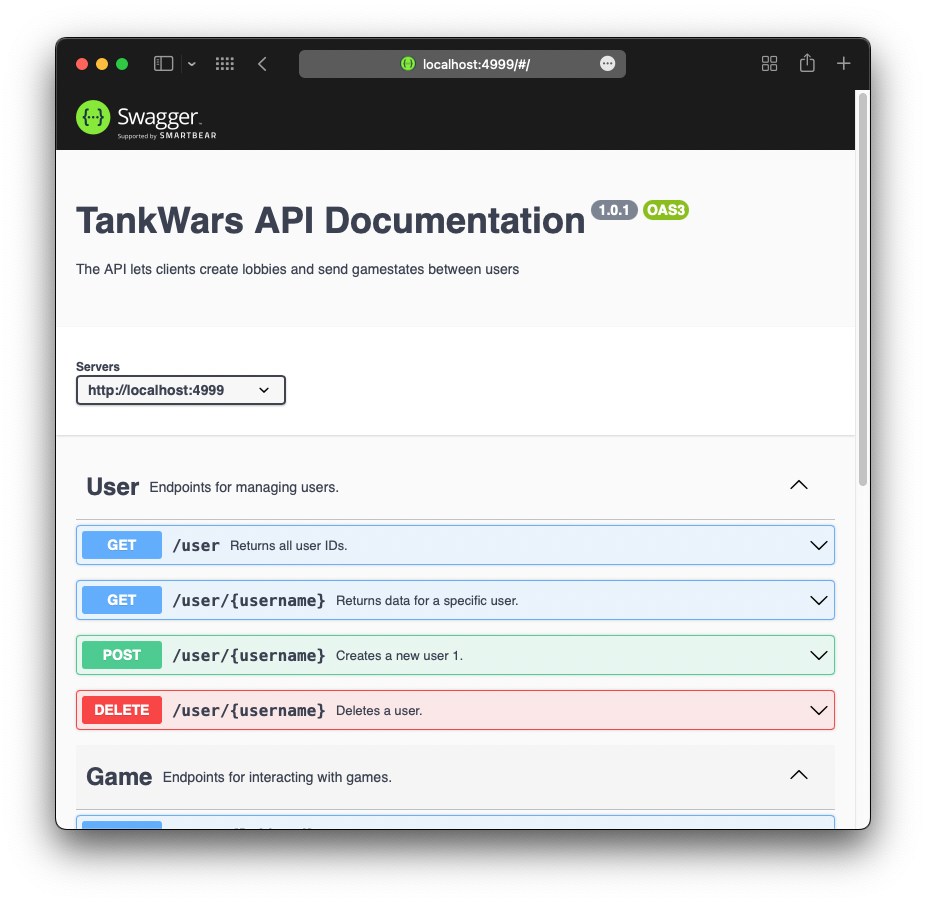

# Backend

The backend handles ongoing lobbies and games. Also communicates with the firebase database for persistance.
The backend uses Node and is written in TypeScript with Express for routing.

## Documentation

The API documentation is available at the root of the backend (http://localhost:4999/). The documentation is generated with Swagger.

## Setup

To access database you must add firebase-key to the following directory: `backend/keys/fb-key.json`

## How to run the backend

Run the following commands in your terminal:

- `yarn` download dependencies
- `yarn start:local` start server in development mode on localhost:4999
- `yarn start:prod` start server in production mode on {machine_ip}:80

## CD: Deployment to virtual machine

The backend is automatically deployed to a virtual machine when a commit is pushed to the main branch. The deployment is done by a Gitlab CI server that connects to the VM with SSH and runs the `vm.sh` script.

The VM is hosted on NTNU (requires VPN) and can be accessed on the following address:
IP: 10.212.26.72
Port: 80

The VM utilizes Nodemon to automatically restart the server if a crash occurs.

## CI: Testing

The backend is automatically tested by a Gitlab CI server for each commit.
Formatter: `yarn prettier`
e2e tests: `yarn test`

## Restrictions

The backend will only allow 30 requests per minute from the same IP address. This is to prevent abuse of the API.
